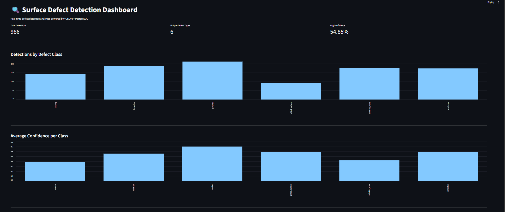

# Surface Defect Detection System

An end-to-end computer vision pipeline that detects and classifies surface defects on industrial steel parts using YOLOv8, stores results in a PostgreSQL database, and visualizes analytics on a live dashboard.

---

## What it does

- Runs YOLOv8 object detection on steel surface images
- Detects 6 defect types: crazing, inclusion, patches, pitted surface, rolled-in scale, scratches
- Saves every detection (class, confidence, bounding box, timestamp) to a PostgreSQL database
- Serves detection data via a FastAPI REST endpoint
- Displays real-time analytics on a Streamlit dashboard

---

## Problem it solves

Manual visual inspection of manufactured parts is slow, inconsistent, and prone to human fatigue. This system automates quality control — detecting defects faster and more consistently than human inspectors, logging every result for traceability.

---

## System Architecture

Images → YOLOv8 Model → Detection Results → PostgreSQL Database → FastAPI → Streamlit Dashboard

---

## Tech Stack

- **Model:** YOLOv8s (Ultralytics)
- **Dataset:** NEU Surface Defect Dataset (1800 images, 6 classes)
- **Backend:** FastAPI + psycopg2
- **Database:** PostgreSQL 18
- **Dashboard:** Streamlit
- **Environment:** Python 3.13, CUDA 12.5, RTX 3050

---

## How to Run

1. Clone the repository:
```bash
git clone https://github.com/your-username/surface-defect-detection.git
cd surface-defect-detection
```

2. Create virtual environment and install dependencies:
```bash
python -m venv venv
venv\Scripts\activate
pip install -r requirements.txt
```

3. Create `.env` file in project root:
DB_HOST=localhost
DB_PORT=5432
DB_NAME=testdb
DB_USER=postgres
DB_PASSWORD=your_password

4. Run predictions and populate database:
```bash
python pipeline/predict.py
```

5. Start the API:
```bash
uvicorn api.main:app --reload
```

6. Launch dashboard:
```bash
streamlit run dashboard/app.py
```

---

## Results

- **mAP50:** 0.73
- **mAP50-95:** 0.39
- **Epochs:** 150
- **Image size:** 416x416
- **Total detections on validation set:** 985
- **Avg confidence across all classes:** 54.82%
- **Best performing class:** patches (highest confidence)
- **Most challenging class:** crazing (lowest confidence)

---

## Future Improvements

- Export model to ONNX/TensorRT for faster inference
- Deploy on edge devices (NVIDIA Jetson)
- Add real-time video stream support via OpenCV
- Implement active learning to improve model on uncertain detections

